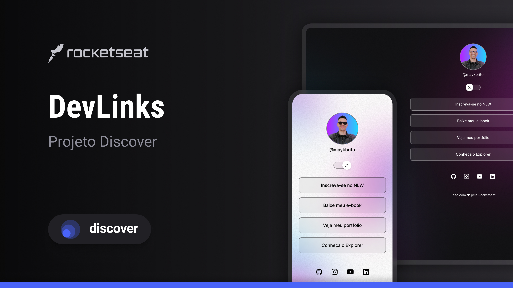

<h1 align="center">DevLinks</h1>

Programa exclusivo e gratuito, promovido pela Rocketseat para ensino de tecnologias WEB.

    

## 🚀 Tecnologias

Esse projeto foi desenvolvido com as seguintes tecnologias:

- HTML e CSS
- JavaScript
- Git e Github
- Figma

## 💻 Projeto 

O DevLinks é um agregador de links para usar como cartão de visitas online.

## 📑 Layout

Você pode visualizar o layout do projeto através [DESSE LINK](https://www.figma.com/design/5kTrORV330Ky55nTQ6yB66/DevLinks-%E2%80%A2-Projeto-Discover--Community-?node-id=1437-191&t=428lNUcDgwzijmVE-0). É necessário ter conta no [FIGMA](https://www.figma.com/) para acessá-lo.

## 💜 Rocketseat

[Comunidade Rocketseat](https://discord.gg/rocketseat)